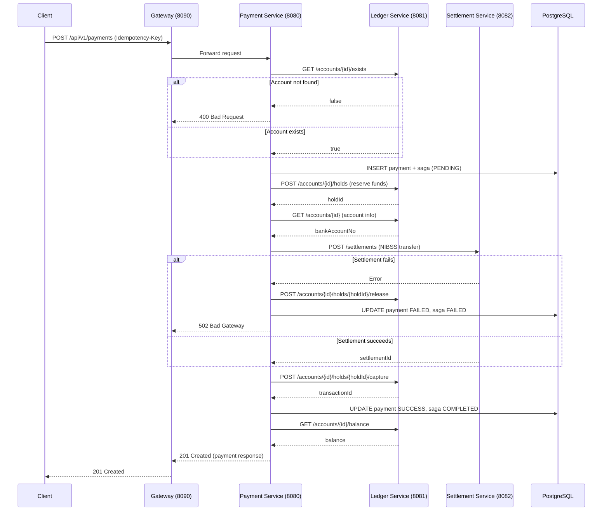

# Payment Service Platform

Comprehensive documentation for the `payment-service` codebase — a microservices-based payment orchestration platform.

---

## 1. Project Overview

### What the System Does

This platform is a **distributed payment orchestration engine** designed to process outbound fund transfers. It coordinates fund reservation, settlement via external switch providers, and ledger capture using a Saga pattern to ensure data consistency across services.

### Core Business Purpose

- **Fund Transfer Orchestration**: Enable users to initiate payments from a ledger account to external beneficiary accounts.
- **Consistency Guarantees**: Ensure that funds are only debited from the ledger if settlement succeeds; otherwise, funds are released back to the user.
- **Compliance & Limits**: Enforce KYC-tiered daily transaction limits and account-level balance checks.
- **Idempotency**: Prevent duplicate payments via request-level idempotency keys.

### Key Features and Capabilities

| Feature | Description |
|---------|-------------|
| **Saga Orchestration** | Distributed transaction coordinator (`payment-service`) manages reserve → settle → capture flow with compensations. |
| **Fund Holds** | Ledger supports temporary fund reservations (holds) with automatic expiry. |
| **Settlement Gateway** | Abstracted provider interface with a configurable mock NIBSS client for local testing. |
| **Circuit Breakers** | Per-service Resilience4j circuit breakers prevent cascade failures. |
| **Idempotency** | Dual-layer idempotency: in-memory request deduplication + database unique constraint on `idempotency_key`. |
| **Observability** | Prometheus metrics, distributed OpenTelemetry tracing, and structured logging across all services. |
| **API Gateway** | Single entry point with route-specific circuit breaker fallbacks. |

---

## 2. Architecture

### High-Level Architecture

```
┌─────────────────┐
│   API Gateway   │  ← Spring Cloud Gateway (port 8090)
│  (gateway-svc)  │     Routes + Circuit Breaker Fallbacks
└────────┬────────┘
         │
    ┌────┴────┬────────────┬────────────┐
    │         │            │            │
┌───▼───┐ ┌───▼────┐ ┌────▼─────┐ ┌───▼────────┐
│Payment│ │ Ledger │ │Settlement│ │Prometheus  │
│Svc    │ │ Svc    │ │ Svc      │ │+ Grafana   │
│:8080  │ │ :8081  │ │ :8082    │ │            │
└───┬───┘ └───┬────┘ └────┬─────┘ └────────────┘
    │         │           │
    └─────────┴───────────┘
              │
       ┌──────▼──────┐
       │  PostgreSQL │  ← Shared database (port 5432)
       │   :5432     │     `PaymentService` database
       └─────────────┘
```

### Key Components / Services

| Service | Port | Responsibility |
|---------|------|----------------|
| **`gateway-service`** | `8090` | API Gateway. Routes requests to downstream services. Provides circuit-breaker fallback endpoints. |
| **`payment-service`** | `8080` | **Orchestrator**. Exposes payment initiation API. Coordinates the Saga across Ledger and Settlement. |
| **`ledger-service`** | `8081` | **Account & Hold Manager**. Manages ledger accounts, balance enquiries, fund holds, captures, releases, and credits. Enforces daily limits. |
| **`settlement-service`** | `8082` | **Settlement Engine**. Integrates with the NIBSS switch (mocked). Records settlement outcomes and supports reversals. |
| **`payment-common`** | — | **Shared Library**. Cross-cutting DTOs, exceptions, and Jackson configuration. Has no Spring Boot application class. |

### Communication Patterns

- **Synchronous HTTP**: All inter-service communication is synchronous REST over HTTP using **OpenFeign** clients.
- **Saga Pattern**: The `payment-service` implements an **Orchestration-based Saga**. Each step is a local DB transaction + remote service call. Compensation logic is explicitly coded for rollback.
- **No Event Bus**: There is no message broker (Kafka, RabbitMQ). The design intentionally trades eventual consistency simplicity for synchronous reliability, with the trade-off being tighter coupling.

### Data Flow Diagram (Mermaid)



---

## 3. Tech Stack

### Languages, Frameworks, Libraries

| Layer | Technology | Version |
|-------|------------|---------|
| Language | Java | 17 |
| Framework | Spring Boot | 3.3.5 |
| Cloud | Spring Cloud | 2023.0.3 |
| Gateway | Spring Cloud Gateway | — |
| HTTP Client | OpenFeign | — |
| Resilience | Resilience4j | 2.2.0 |
| ORM | Spring Data JPA / Hibernate | — |
| Utilities | Lombok | 1.18.46 |
| Validation | Jakarta Bean Validation | — |
| JSON | Jackson (+ JSR310 datatype module) | — |

### Infrastructure

| Component | Technology |
|-----------|------------|
| Containerization | Docker & Docker Compose |
| Metrics | Prometheus |
| Dashboards | Grafana |
| Tracing | OpenTelemetry (via Micrometer Tracing Bridge) |
| Build Tool | Maven (multi-module) |

### Databases and Caching

| Component | Technology | Usage |
|-----------|------------|-------|
| Primary Database | PostgreSQL 16 | Shared database for all services (`PaymentService`) |
| Connection Pool | HikariCP | Per-service pool (payment: 35 max; ledger/settlement: 20 max) |
| In-Memory Store | `ConcurrentHashMap` | `InMemoryIdempotencyStore` for request deduplication (non-production) |
| Schema Management | Hibernate `ddl-auto=update` | Auto-migration in current setup (Flyway dependency declared but unused) |

---

## 4. Code Structure

### Folder / Module Breakdown

```
payment/
├── pom.xml                          # Parent POM (dependency management)
├── docker-compose.yml               # Full local stack
├── infra/
│   ├── prometheus/prometheus.yml    # Scraping config
│   └── grafana/provisioning/        # Dashboards & datasources
├── payment-common/                  # Shared DTOs, exceptions, config
│   └── src/main/java/com/structure/payment/common/
│       ├── config/JacksonConfig.java
│       ├── dto/
│       └── exception/
├── payment-service/                 # Orchestrator
│   └── src/main/java/com/structure/payment/payment/
│       ├── controller/
│       ├── service/
│       ├── client/                  # Feign clients + fallback factories
│       ├── dto/
│       ├── model/
│       ├── repository/
│       ├── utils/                   # Idempotency filter + store
│       └── exception/
├── ledger-service/                  # Account & hold management
│   └── src/main/java/com/structure/payment/ledger/
│       ├── controller/
│       ├── service/
│       ├── model/
│       ├── repository/
│       └── exception/
├── settlement-service/              # NIBSS gateway
│   └── src/main/java/com/structure/payment/settlement/
│       ├── controller/
│       ├── service/
│       ├── config/Nibss/            # Client interface + mock impl
│       ├── model/
│       ├── repository/
│       └── exception/
└── gateway-service/                 # API Gateway
    └── src/main/java/com/structure/payment/gateway/
        └── controller/FallbackController.java
```

### Key Packages and Layers

| Layer | Responsibility |
|-------|----------------|
| **`controller`** | REST API entry points. Request validation (`@Valid`), header extraction, response assembly. |
| **`service`** | Business logic. `PaymentSagaOrchestrator` is the most critical class. Ledger and Settlement services encapsulate domain rules. |
| **`client`** | Feign client interfaces (`LedgerApi`, `SettlementApi`) and `FallbackFactory` implementations for graceful degradation. |
| **`model`** | JPA entities with Hibernate annotations, indexes, and enum mappings. |
| **`repository`** | Spring Data JPA interfaces. Some include custom `@Query` methods for reporting and recovery. |
| **`utils`** | Cross-cutting utilities like `IdempotencyFilter` (Servlet filter) and `InMemoryIdempotencyStore`. |
| **`config`** | Circuit breaker wiring, retry logic, and NIBSS client beans. |
| **`exception`** | `@RestControllerAdvice` global exception handlers mapping domain exceptions to HTTP status codes. |

### Naming Conventions

- **Packages**: Reverse-domain style: `com.structure.payment.{service}.{layer}`
- **Entities**: Singular nouns (`Payments`, `Hold`, `SagaState`)
- **DTOs**: Suffix `Dto` or descriptive names (`PaymentRequest`, `PaymentResponse`, `BalanceResponse`)
- **Repositories**: Suffix `Repository` extending `JpaRepository`
- **Exceptions**: Suffix `Exception`, extending `RuntimeException`
- **Enums**: Singular, ALL_CAPS values (`SagaStatus`, `PaymentStatus`, `HoldStatus`)

---

## 5. Key Workflows / Use Cases

### Use Case 1: Successful Payment Transfer

1. **Client** sends `POST /api/v1/payments` with `Idempotency-Key` header and request body.
2. **`IdempotencyFilter`** checks the in-memory store. If new, marks as `PROCESSING`.
3. **`PaymentController`** builds a `PaymentCommand` and delegates to `PaymentSagaOrchestrator.execute()`.
4. **Account Validation**: `ledgerApi.accountExists()` is called.
5. **Initialize Saga**: A `Payments` record and `SagaState` are persisted in a short `@Transactional` block. An idempotency check via `idempotency_key` unique constraint prevents duplicates.
6. **Reserve Funds**: `ledgerApi.reserveFunds()` places an `ACTIVE` hold on the ledger account.
7. **Settlement**: `settlementApi.settle()` calls the NIBSS transfer endpoint. On success, a `SettlementRecord` is created.
8. **Capture Hold**: `ledgerApi.captureHold()` converts the hold into a debit transaction, updates the ledger balance, and increments `dailyUsed`.
9. **Mark Success**: Payment status updated to `SUCCESS`, saga status to `COMPLETED`.
10. **Response**: Balance is fetched and a rich `PaymentResponse` (201 Created) is returned.

### Use Case 2: Settlement Failure & Compensation

1. Steps 1–6 complete successfully (funds are reserved).
2. **Settlement fails** (NIBSS timeout or business rejection).
3. **`PaymentSagaOrchestrator`** catches the exception and triggers **compensation**:
   - `ledgerApi.releaseHold()` is called to free the reserved funds.
   - If settlement succeeded *before* capture failed (extremely rare), a reversal is initiated and a credit is posted.
4. Payment and Saga statuses are updated to `FAILED` and `COMPENSATED` (or `COMPENSATION_FAILED`).
5. A `SettlementException` or `PaymentFailedException` is thrown, resulting in a `502 Bad Gateway` response.

### Use Case 3: Duplicate Request Handling

1. Client retries with the same `Idempotency-Key`.
2. **`IdempotencyFilter`** finds a terminal entry (`COMPLETED` or `FAILED`) and returns the cached response with header `X-Idempotent-Replayed: true`.
3. If the first request is still `PROCESSING`, the filter returns `409 Conflict`.
4. Database-level unique constraint on `payments.idempotency_key` acts as a safety net.

---

## 6. API Documentation

### Endpoints

#### Payment Service (`:8080`)

| Method | Endpoint | Description |
|--------|----------|-------------|
| `POST` | `/api/v1/payments` | Initiate a new payment |

#### Ledger Service (`:8081`)

| Method | Endpoint | Description |
|--------|----------|-------------|
| `GET` | `/api/v1/ledger/accounts/{accountId}/exists` | Check if account exists |
| `GET` | `/api/v1/ledger/accounts/{accountId}` | Get account info |
| `GET` | `/api/v1/ledger/accounts/{accountId}/balance` | Get balance (ledger, available, daily limits) |
| `POST` | `/api/v1/ledger/accounts/{accountId}/holds` | Reserve funds (returns `holdId`) |
| `POST` | `/api/v1/ledger/accounts/{accountId}/holds/{holdId}/capture` | Capture a hold (debit account) |
| `POST` | `/api/v1/ledger/accounts/{accountId}/holds/{holdId}/release` | Release an active hold |
| `POST` | `/api/v1/ledger/accounts/{accountId}/credits` | Post a credit (reversal) |

#### Settlement Service (`:8082`)

| Method | Endpoint | Description |
|--------|----------|-------------|
| `POST` | `/api/v1/settlements` | Execute a settlement |
| `POST` | `/api/v1/settlements/{settlementId}/reverse` | Reverse a settlement |
| `GET` | `/api/v1/settlements/{settlementId}` | Lookup settlement reference |

#### Gateway Service (`:8090`)

Routes mirror the above endpoints. Fallback endpoints:

| Endpoint | Fallback For |
|----------|--------------|
| `/fallback/payment` | payment-service |
| `/fallback/ledger` | ledger-service |
| `/fallback/settlement` | settlement-service |

### Request / Response Formats

#### Initiate Payment

**Request:**

```http
POST /api/v1/payments HTTP/1.1
Idempotency-Key: <uuid-or-string-8-255-chars>
Content-Type: application/json

{
  "accountId": "550e8400-e29b-41d4-a716-446655440000",
  "amount": 50000.00,
  "description": "Invoice #1234 payment",
  "beneficiaryAccount": "1234567890",
  "beneficiaryBank": "First Bank",
  "beneficiaryName": "John Doe"
}
```

**Response (201 Created):**

```json
{
  "paymentId": "pay-uuid",
  "status": "SUCCESS",
  "amount": 50000.00,
  "description": "Invoice #1234 payment",
  "transactionId": "txn-uuid",
  "settlementId": "STTL-MOCK-XXXX",
  "sagaId": "saga-uuid",
  "balance": {
    "ledger": 950000.00,
    "available": 900000.00
  },
  "initiatedAt": "2024-01-15T10:30:00Z",
  "completedAt": "2024-01-15T10:30:02Z"
}
```

### Authentication / Authorization

> **Current State**: The codebase does **not** implement authentication or authorization. There are no JWT filters, OAuth2 resource servers, or API key validation layers. The `Idempotency-Key` header is required but is not an auth token.
>
> **Production Readiness**: Integrate Spring Security with OAuth2/JWT or mTLS before deploying to production.

### Error Handling Patterns

All services return a unified `ApiResponse<T>` envelope on errors:

```json
{
  "success": false,
  "status": 422,
  "message": "Insufficient funds",
  "timestamp": "2024-01-15T10:30:00",
  "errorCode": null,
  "path": "/api/v1/payments",
  "data": null
}
```

**Common HTTP Status Codes:**

| Status | When |
|--------|------|
| `400` | `AccountNotFoundException`, `DailyLimitExceededException`, `HoldNotFoundException` |
| `409` | `DuplicateRequestException` |
| `422` | `InsufficientFundsException`, `PaymentFailedException` |
| `502` | `SettlementException` (downstream failure) |
| `503` | Gateway fallback triggered (service unavailable) |
| `500` | Unhandled server errors |

---

## 7. Database Design

### Schema Overview

All services share a single PostgreSQL database (`PaymentService`). Tables are service-scoped by naming convention.

### Key Tables / Entities

#### `payments` (Payment Service)

| Column | Type | Constraints |
|--------|------|-------------|
| `id` | UUID | PK |
| `account_id` | VARCHAR | NOT NULL, FK (logical) to ledger |
| `amount` | DECIMAL | |
| `status` | VARCHAR(20) | Enum: `PENDING`, `SUCCESS`, `FAILED`, `CANCELLED` |
| `description` | VARCHAR | |
| `beneficiary_acct` | VARCHAR(10) | NUBAN format |
| `beneficiary_name` | VARCHAR | |
| `idempotency_key` | VARCHAR(255) | **UNIQUE**, NOT NULL |
| `initiated_at` | TIMESTAMP | Auto |
| `completed_at` | TIMESTAMP | |
| `version` | BIGINT | Optimistic locking (`@Version`) |

**Indexes:** `idx_payments_account_id`, `idx_payments_idempotency_key` (unique), `idx_payments_status`, `idx_payments_initiated_at`

#### `saga_state` (Payment Service)

| Column | Type | Constraints |
|--------|------|-------------|
| `id` | UUID | PK |
| `payment_id` | UUID | FK → `payments.id`, UNIQUE |
| `status` | VARCHAR(40) | Saga status enum |
| `hold_id` | VARCHAR | Reference to ledger hold |
| `settlement_id` | VARCHAR | Reference to settlement record |
| `steps` | JSONB | Array of `SagaStep` (Hibernate `@JdbcTypeCode(JSON)`) |
| `started_at` | TIMESTAMP | Auto |
| `updated_at` | TIMESTAMP | Auto |

#### `ledger_accounts` (Ledger Service)

| Column | Type | Constraints |
|--------|------|-------------|
| `id` | UUID | PK |
| `owner_name` | VARCHAR | NOT NULL |
| `bank_account_no` | VARCHAR(10) | Indexed |
| `ledger_balance` | DECIMAL | NOT NULL |
| `daily_limit` | DECIMAL | NOT NULL |
| `daily_used` | DECIMAL | NOT NULL |
| `last_used_date` | DATE | |
| `kyc_tier` | VARCHAR(10) | Enum: `TIER_1`, `TIER_2`, `TIER_3` |
| `created_at` / `updated_at` | TIMESTAMP | |

#### `holds` (Ledger Service)

| Column | Type | Constraints |
|--------|------|-------------|
| `id` | UUID | PK |
| `account_id` | UUID | FK → `ledger_accounts.id` |
| `amount` | DECIMAL | |
| `reason` | VARCHAR | |
| `status` | VARCHAR(20) | Enum: `ACTIVE`, `CAPTURED`, `RELEASED` |
| `expires_at` | TIMESTAMP | 5-minute TTL default |
| `created_at` | TIMESTAMP | Auto |
| `version` | BIGINT | Optimistic locking |

**Indexes:** `idx_holds_account_status`, `idx_holds_expires_at`

#### `Transactions` (Ledger Service)

| Column | Type | Constraints |
|--------|------|-------------|
| `id` | UUID | PK |
| `account_id` | UUID | FK |
| `hold_id` | UUID | FK (nullable) |
| `type` | VARCHAR(20) | Enum: `DEBIT`, `CREDIT`, `HOLD_RELEASED` |
| `amount` | DECIMAL | |
| `balance_after` | DECIMAL | |
| `reason` | VARCHAR | |
| `reference` | VARCHAR | Indexed |
| `posted_at` | TIMESTAMP | Auto |

**Indexes:** `idx_transactions_account_posted`, `idx_transactions_hold_id`, `idx_transactions_reference`

#### `Settlement` (Settlement Service)

| Column | Type | Constraints |
|--------|------|-------------|
| `id` | UUID | PK |
| `payment_id` | VARCHAR | UNIQUE, NOT NULL |
| `provider` | VARCHAR | e.g., `Mock` |
| `provider_ref` | VARCHAR | Switch reference |
| `amount` | DECIMAL | |
| `response_code` | VARCHAR | |
| `status` | VARCHAR(20) | Enum: `SETTLED`, `REVERSED` |
| `settled_at` | TIMESTAMP | Auto |
| `reversed_at` | TIMESTAMP | |
| `reversal_ref` | VARCHAR | |

#### `idempotency` (Payment Service)

| Column | Type | Constraints |
|--------|------|-------------|
| `id` | UUID | PK |
| `key` | VARCHAR | UNIQUE |
| `payment_id` | VARCHAR | UNIQUE |
| `status` | VARCHAR(20) | `PROCESSING`, `COMPLETED`, `FAILED` |
| `response_status` | VARCHAR | |
| `response_body` | TEXT | |
| `created_at` | TIMESTAMP | Auto |
| `expires_at` | TIMESTAMP | NOT NULL |

### Important Constraints

- **Unique Constraints**: `payments.idempotency_key`, `saga_state.payment_id`, `idempotency.key`, `idempotency.payment_id`, `Settlement.payment_id`
- **Optimistic Locking**: `@Version` on `Payments`, `Hold`, and `LedgerAccount` (if added).
- **Pessimistic Locking**: `LedgerAccountRepository.findByIdWithLock()` uses `PESSIMISTIC_WRITE` to prevent race conditions during concurrent fund reservations.

---

## 8. Configuration & Environment Setup

### Required Environment Variables

The following are the key variables used across `docker-compose.yml` and `application.properties`:

| Variable | Default (Local) | Description |
|----------|-----------------|-------------|
| `SPRING_DATASOURCE_URL` | `jdbc:postgresql://localhost:5432/PaymentService` | PostgreSQL JDBC URL |
| `SPRING_DATASOURCE_USERNAME` | `postgres` | DB username |
| `SPRING_DATASOURCE_PASSWORD` | `Bolu@123wat$ife` | DB password |
| `SERVER_PORT` | Varies by service | HTTP port |
| `LEDGER-SERVICE_URL` | `http://localhost:8081` | Ledger service base URL (payment-service) |
| `SETTLEMENT-SERVICE_URL` | `http://localhost:8082` | Settlement service base URL (payment-service) |
| `NIBSS_MOCK_FAIL_RATE` | `0.2` | Simulated NIBSS failure rate (0.0–1.0) |
| `NIBSS_MOCK_LATENCY_MS` | `150` | Simulated NIBSS latency |

### How to Run Locally (Step-by-Step)

#### Prerequisites

- Java 17+
- Maven 3.9+
- Docker & Docker Compose

#### Option A: Docker Compose (Recommended)

```bash
# Clone / navigate to project root
cd payment

# Build all modules
./mvnw clean install

# Start the entire stack
# (Postgres + all services + Prometheus + Grafana)
docker-compose up --build
```

**Access Points:**

| Service | URL |
|---------|-----|
| API Gateway | http://localhost:8090 |
| Payment Service (direct) | http://localhost:8080 |
| Ledger Service (direct) | http://localhost:8081 |
| Settlement Service (direct) | http://localhost:8082 |
| Prometheus | http://localhost:9090 |
| Grafana | http://localhost:3000 (admin/admin) |

#### Option B: IntelliJ / IDE (Individual Services)

1. Start PostgreSQL manually (or via Docker):
   ```bash
   docker run -d --name payment-postgres \
     -e POSTGRES_DB=PaymentService \
     -e POSTGRES_USER=postgres \
     -e POSTGRES_PASSWORD=Bolu@123wat$ife \
     -p 5432:5432 postgres:16-alpine
   ```
2. Run `LedgerServiceApplication` (port 8081)
3. Run `SettlementServiceApplication` (port 8082)
4. Run `PaymentServiceApplication` (port 8080)
5. Run `GatewayServiceApplication` (port 8090)

> **Note**: Ensure `application.properties` in each service points to `localhost` rather than Docker service names when running outside Compose.

### Build and Deployment Process

```bash
# Compile & run tests
./mvnw clean verify

# Build Docker images (via Spring Boot plugin or Dockerfiles)
# The docker-compose.yml uses per-service Dockerfiles
./mvnw spring-boot:build-image -pl payment-service
./mvnw spring-boot:build-image -pl ledger-service
./mvnw spring-boot:build-image -pl settlement-service
./mvnw spring-boot:build-image -pl gateway-service
```

Each service contains a `Dockerfile` for multi-stage or direct JAR builds.

---

## 9. Common Patterns & Conventions

### Design Patterns Used

| Pattern | Implementation |
|---------|----------------|
| **Saga (Orchestration)** | `PaymentSagaOrchestrator` coordinates reserve → settle → capture with explicit compensation on failure. |
| **Circuit Breaker** | Resilience4j via `PaymentCircuitBreakerConfig` and Spring Cloud Gateway routes. Business exceptions are *ignored* so they don't trip the breaker. |
| **Retry with Jitter** | `RetryWithJitter` utility in settlement-service prevents thundering herds with exponential backoff + randomization. |
| **Fallback Factory** | Feign `FallbackFactory` implementations (`LedgerApiFallbackFactory`, `SettlementApiFallbackFactory`) provide graceful degradation when downstream services are unreachable. |
| **Idempotency Pattern** | Two-tier: Servlet filter (fast in-memory) + DB unique constraint ( durable safety net). |
| **Optimistic Locking** | `@Version` on JPA entities to prevent lost updates. |
| **Pessimistic Locking** | `findByIdWithLock()` using `LockModeType.PESSIMISTIC_WRITE` on ledger accounts during fund reservation. |
| **Factory Method** | `TransactionEntity.ofDebit()`, `.ofCredit()`, `.ofHoldReleased()` for clean entity construction. |
| **DTO Pattern** | All cross-service communication uses flat DTOs to avoid leaking JPA entities between bounded contexts. |

### Coding Standards and Best Practices

- **Transactional Boundaries**: The saga orchestrator is intentionally **non-transactional** at the top level to avoid holding DB connections across remote Feign calls. Each local mutation (save, transition, fail) is wrapped in a short `@Transactional` helper method.
- **Self-Injection**: `PaymentSagaOrchestrator` uses `@Lazy` self-injection (`private PaymentSagaOrchestrator self`) to ensure internal `@Transactional` method calls are proxied by Spring.
- **Explicit Compensations**: Every failure path has a defined compensation action (release hold, reverse settlement, post credit).
- **Structured Logging**: All services log with `traceId` / `spanId` via Micrometer Tracing.
- **Validation**: Jakarta Bean Validation on controller inputs (`@NotBlank`, `@Pattern`, `@Min`, `@Max`).

---

## 10. Known Issues / Technical Debt

### Current Limitations

1. **No Authentication / Authorization**: The system is completely open. No JWT, OAuth2, API keys, or RBAC.
2. **In-Memory Idempotency Store**: `InMemoryIdempotencyStore` is not suitable for production multi-instance deployments. A Redis or persistent store is needed.
3. **No Message Broker**: Synchronous HTTP saga means the orchestrator thread is held for the entire duration. Long-running settlements will block.
4. **Shared Database**: All services share one PostgreSQL instance. This violates strict microservice data isolation.
5. **Hibernate `ddl-auto=update`**: Schema is auto-managed. No Flyway or Liquibase migrations are active despite the dependency being present.
6. **Mock NIBSS Only**: The `NibssClient` interface has only a `MockNibssClient` implementation. No real NIBSS/production adapter exists.
7. **No Saga Recovery Job**: `findStalePendingPayments()` and `findSagasNeedingAttention()` queries exist, but there is no scheduled cron job to recover stuck sagas automatically.
8. **Simple Health Checks**: Docker Compose health checks use `wget`. No deep readiness checks (e.g., DB connection validation) are implemented.
9. **Gateway Route Secret Leak**: `application.properties` in `gateway-service` contains `[AWS_SECRET_KEY_REDACTED]` in a route filter, suggesting a credential was committed and redacted afterward — investigate history.

### Areas for Improvement

| Priority | Improvement |
|----------|-------------|
| **High** | Integrate Spring Security (OAuth2/JWT or mTLS). |
| **High** | Replace `InMemoryIdempotencyStore` with Redis (`IdempotencyStore` interface already supports swap). |
| **High** | Implement a scheduled saga recovery job for `PENDING` payments older than N minutes. |
| **Medium** | Adopt Flyway for versioned schema migrations; remove `ddl-auto=update`. |
| **Medium** | Split database per service or use schema-per-service to enforce bounded contexts. |
| **Medium** | Add a real `NibssClient` implementation with proper mapping for production NIBSS/NFPS specs. |
| **Medium** | Introduce an async event bus (Kafka/RabbitMQ) for non-blocking saga steps and event sourcing. |
| **Low** | Expand test coverage; currently only auto-generated Spring Boot test stubs exist. |
| **Low** | Add deep health indicators (`DataSourceHealthIndicator`, `DiskSpaceHealthIndicator`). |

---

## 11. Contribution Guide

### How to Contribute

1. Fork the repository.
2. Create a feature branch from `main`.
3. Make focused, well-tested changes.
4. Run `./mvnw clean verify` locally.
5. Open a Pull Request with a clear description and linked issue (if applicable).

### Branching Strategy

| Branch | Purpose |
|--------|---------|
| `main` | Production-ready code. Protected. |
| `feature/{short-desc}` | New features |
| `bugfix/{short-desc}` | Bug fixes |
| `hotfix/{short-desc}` | Critical production fixes (branched from `main`) |

### Code Review Expectations

- **Self-review first**: Ensure `./mvnw clean verify` passes.
- **Transactional Boundaries**: New saga steps must include explicit compensation logic.
- **Tests**: Unit tests for service logic; integration tests for Feign clients and repositories.
- **Logging**: Use SLF4J `log.info/warn/error` with contextual parameters (never `printStackTrace`).
- **No Secrets**: Scan for hardcoded credentials before pushing.
- **DTOs for Cross-Service**: Never expose JPA entities in REST or Feign interfaces.

---

*Document generated from codebase analysis. Last updated: 2026-06-23.*
